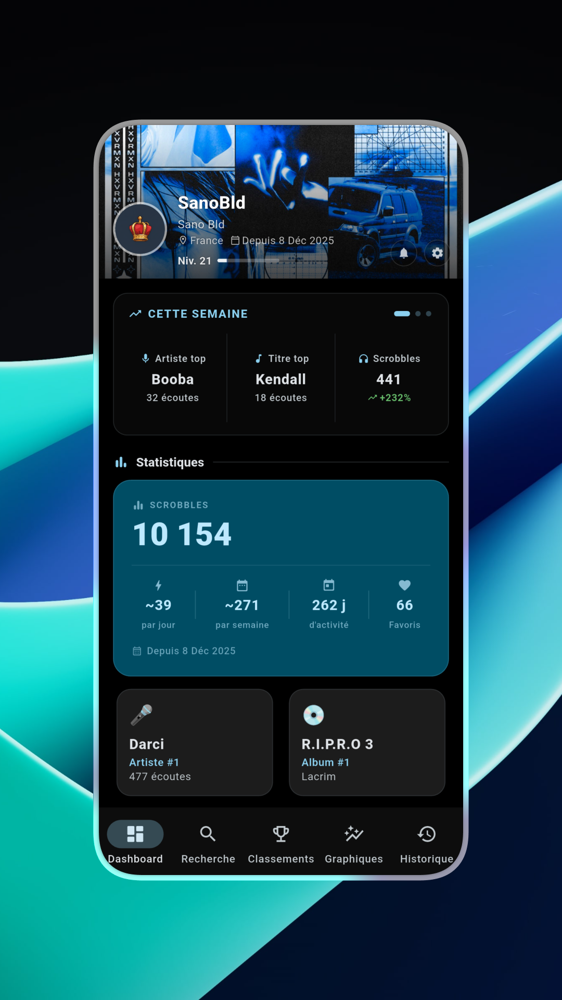
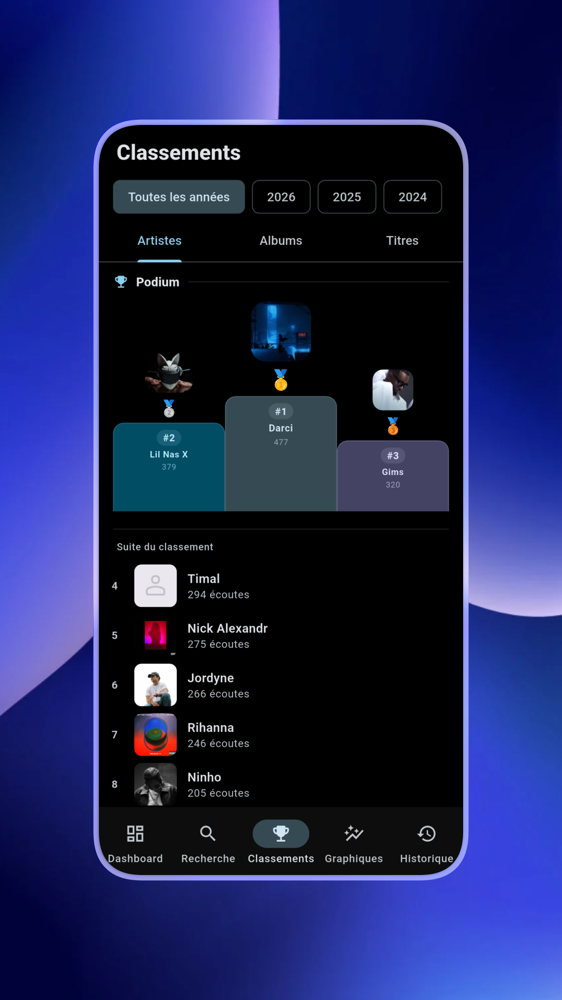
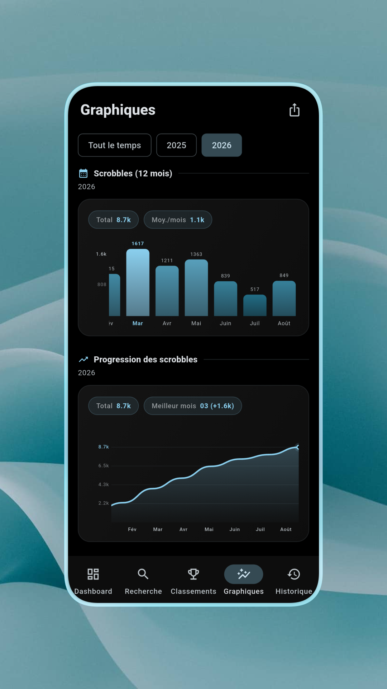
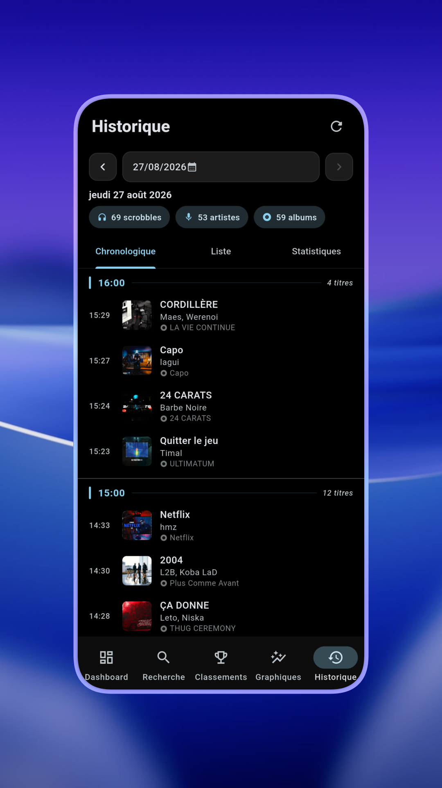
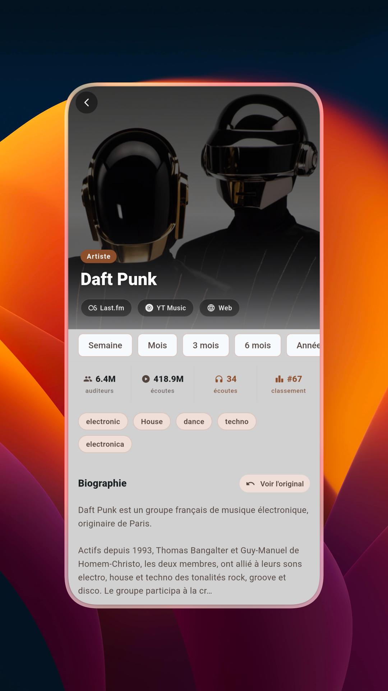
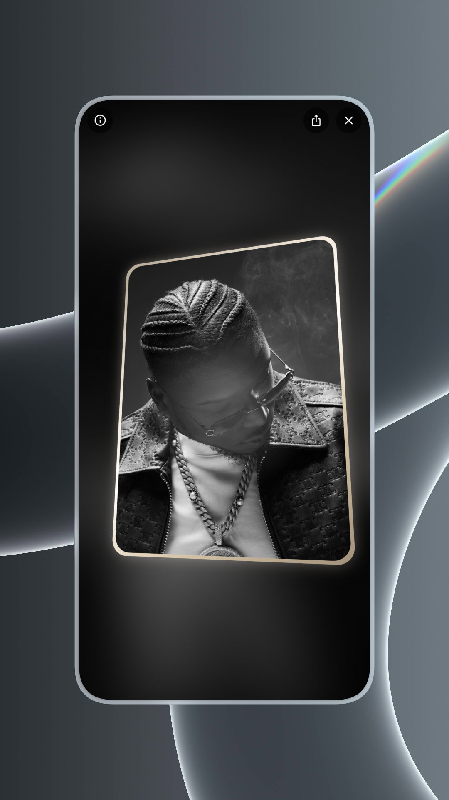
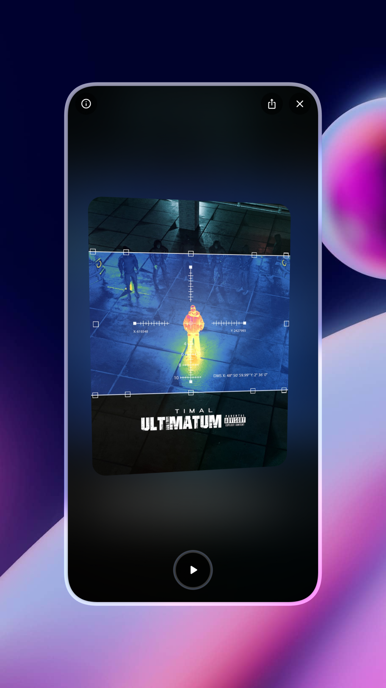
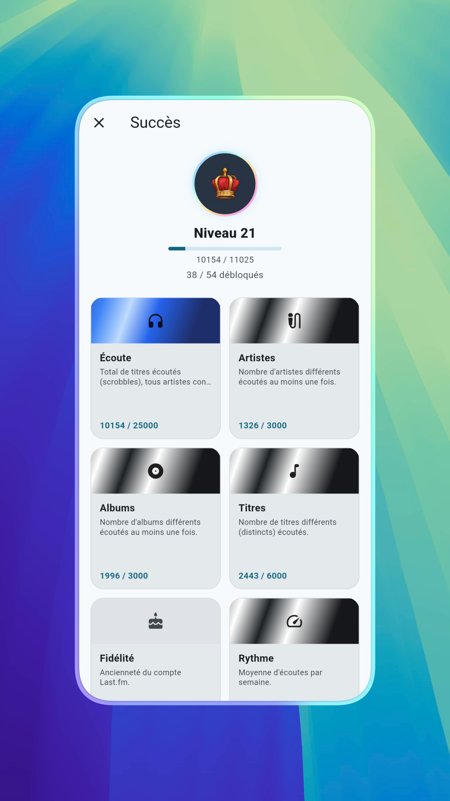
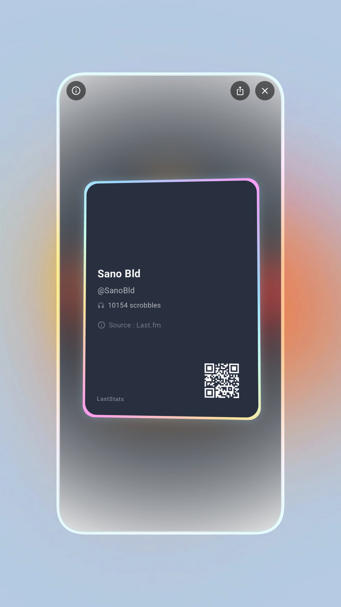

# LastStats

  

  
  
  
  
  

🎵 A modern, multiplatform app built with Flutter and Material You to track and explore your listening habits in real time, using the Last.fm API.

Join the Discord to chat, share feedback, or ask for help: https://discord.gg/JjqmkQgZBs

---

## 📸 Screenshots

  
  
  
  

  
  
  

  
  

---

## Features

**🎨 Design and theming**
- Clean, minimalist interface that works on phones, tablets, and desktop
- Full support for system light and dark mode, plus a pure black OLED theme for AMOLED screens
- Custom accent colors, either from presets or your own hex code
- Dynamic color that can match your device's system palette
- A Nothing OS inspired theme, with a classic red style or a mixed red and yellow style
- Optional Now Playing color mode, where the app's accent shifts to match the artwork of the track you are listening to, with a fallback color and the option to keep the last color once playback stops
- Optional tinted detail sheets, using the dominant color pulled from the album artwork
- Adaptive navigation: a side rail on wide screens, a bottom bar on smaller ones, and a manual switch if you prefer one over the other
- Show or hide labels under the navigation bar icons

**❤️ Favorites**
- Like tracks, artists, and albums directly from the app, through your own Last.fm account
- A dedicated Favorites page with filters and cover art, where you can also remove items
- A small heart badge next to loved tracks in your recent listens, history, and search results, with an option to turn it off
- A favorites count shown on your dashboard, with an option to hide it

**🏆 Achievements**
- A leveling system based on your real listening activity, with dozens of achievements to unlock
- Categories covering listening totals, artist and album diversity, loyalty, comparisons, and more

**📊 Data and sync**
- Direct connection to the Last.fm API for real, live scrobbles, top artists, albums, and tracks
- Flexible time ranges: 7 days, 1 month, 3 months, 6 months, 12 months, or all time
- Background sync that keeps your stats up to date automatically, even when the app is closed
- Local cache to reduce loading times and API calls
- Smart artwork search: if Last.fm has no image, the app looks it up through iTunes, Deezer, and the Cover Art Archive
- No fake or simulated data, everything comes from your real listening history

**🔔 Notifications**
- Get notified when new app updates or news posts are published
- A small badge on the news bell so you never miss an update
- Notifications can be turned on or off at any time, on every supported platform including Windows

**🌍 Languages**
- Available in French, English, Spanish, Chinese, Portuguese, German, Italian, Japanese, Russian, and Arabic
- The app follows your system language automatically, or you can pick one yourself from the settings

**⚙️ Other little touches**
- Haptic feedback on key actions
- A quick search bar to find any artist, album, or track
- Import and export your settings and appearance, useful when switching devices
- Built in update checker that lets you know as soon as a new version is ready to download

---

## 📥 Downloads

You can find every release, for every platform, on the releases page:

https://github.com/SanoBld/LastStats-App/releases

Prebuilt files are also generated automatically after each update, through GitHub Actions:

https://github.com/SanoBld/LastStats-App/actions

Builds coming straight from Actions contain the latest code and may include bugs that have not been fixed yet. If you want a stable experience, use the releases page instead.

Supported platforms: Android, Windows, macOS, and Linux.

---

## 🛠️ Built with

- Flutter and Dart
- Material Design 3 (Material You)
- Last.fm REST API, with iTunes Search, Deezer, and Cover Art Archive as backup sources for missing artwork

---

## ⭐ Star history

<a href="https://www.star-history.com/?repos=SanoBld%2FLastStats&type=date&legend=bottom-right">
  <picture>
    <source media="(prefers-color-scheme: dark)" srcset="https://api.star-history.com/chart?repos=SanoBld/LastStats&type=date&theme=dark&legend=bottom-right&sealed_token=HPdAtBd_SqXDFn9kceQbK4v2Y9TWhOHofoeJdVEg6ySsn4d6BIVPGnnzOdJTzakACyiXmSuvx3pcxDxFhKAQGRJeNwTOvQCCgtJAiBLI0lwOV-hvdNK7mjYRc6PNgeRUWuYssia0e3HcQzx2HzpQuk-OL413b31tu3EgDg2cSVzauc-Lnf76K_FS3vQi" />
    <source media="(prefers-color-scheme: light)" srcset="https://api.star-history.com/chart?repos=SanoBld/LastStats&type=date&legend=bottom-right&sealed_token=HPdAtBd_SqXDFn9kceQbK4v2Y9TWhOHofoeJdVEg6ySsn4d6BIVPGnnzOdJTzakACyiXmSuvx3pcxDxFhKAQGRJeNwTOvQCCgtJAiBLI0lwOV-hvdNK7mjYRc6PNgeRUWuYssia0e3HcQzx2HzpQuk-OL413b31tu3EgDg2cSVzauc-Lnf76K_FS3vQi" />
    
  </picture>
</a>

---

## 🙋 Support and feedback

Found a bug, or have an idea for a new feature? Open an issue here:

https://github.com/SanoBld/LastStats-App/issues

Or join the Discord to chat directly and follow what's coming next:

https://discord.gg/JjqmkQgZBs

---

## About

This project is developed independently, in my free time. It is open source, so you are free to use it, modify it, or contribute to it. If you enjoy the app, a star on the repository always helps.