# LastStats

<p align="center">
  <picture>
    <source media="(prefers-color-scheme: dark)" srcset="assets/icons/app_logo_dark.png">
    
  </picture>
</p>

<p align="center">
  
  
  
  
  <a href="https://discord.gg/JjqmkQgZBs"></a>
</p>

🎵 A modern, multiplatform app built with Flutter and Material 3 Expressive to track and explore your listening habits in real time, using the Last.fm API: stats, rankings, recaps, friends, music compatibility, achievements and animated artist, album and track pages.

🌐 Website: https://sanobld.github.io/LastStats/ · Web version (Beta): https://sanobld.github.io/LastStats/app/

Join the Discord to chat, share feedback, or ask for help: https://discord.gg/JjqmkQgZBs

---

## 📸 Screenshots

<p align="center">
  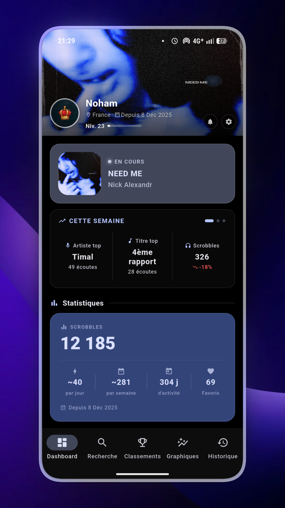
  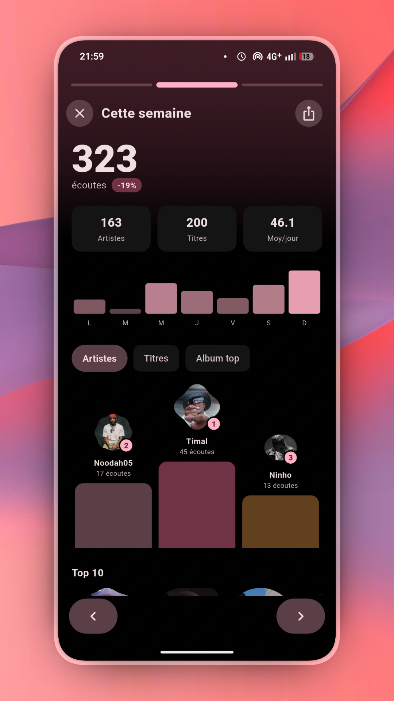
  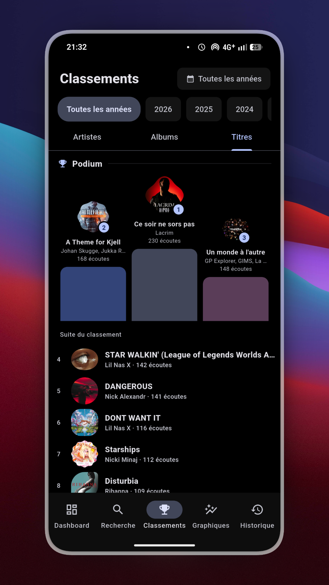
  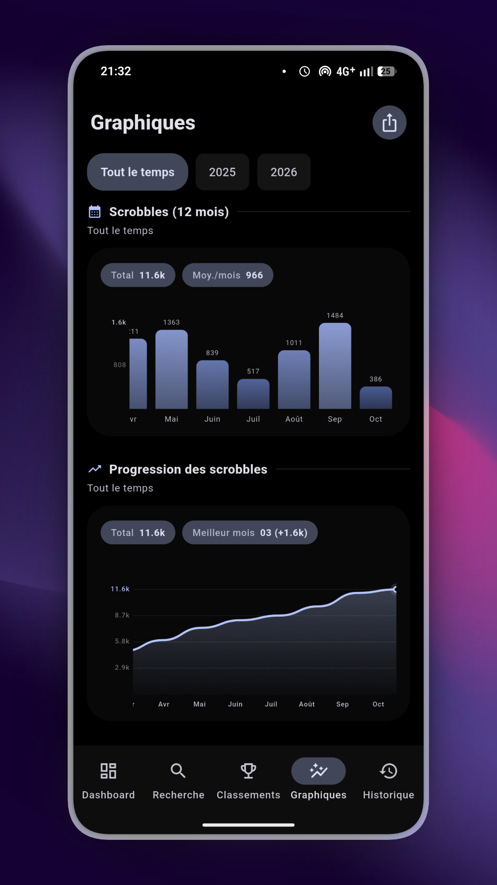
</p>
<p align="center">
  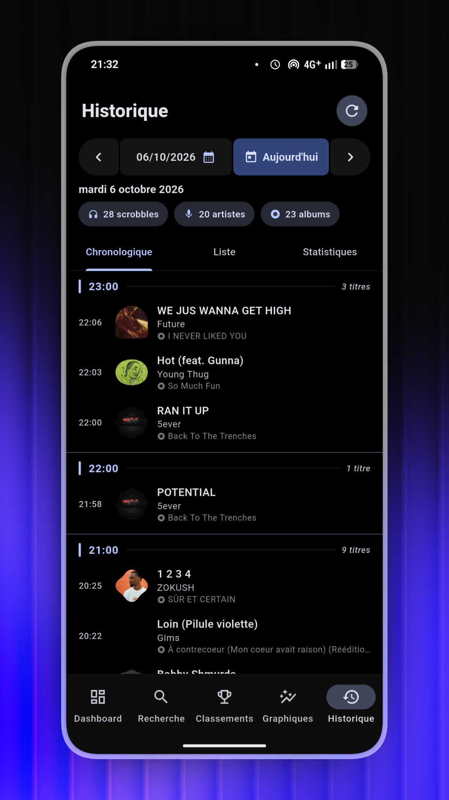
  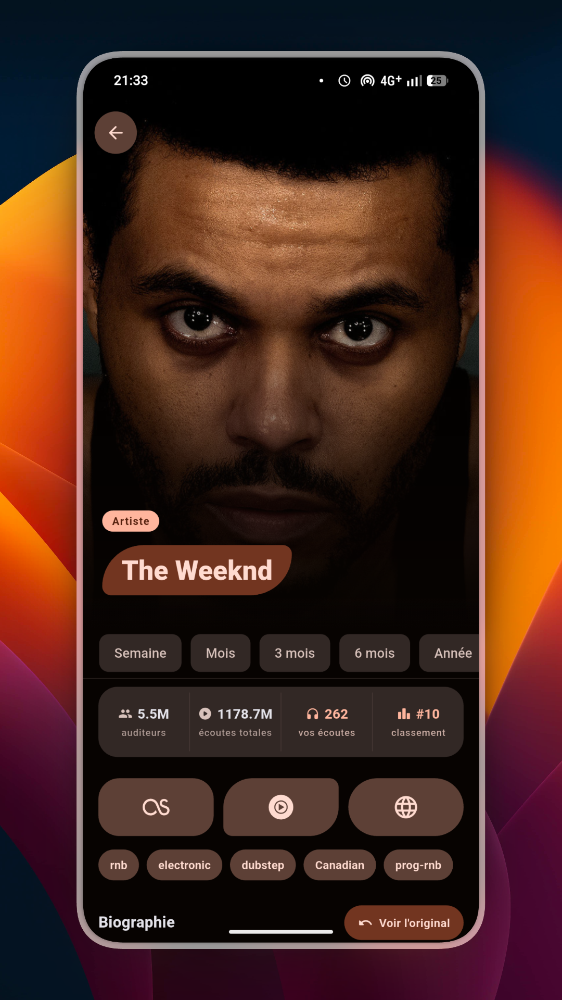
  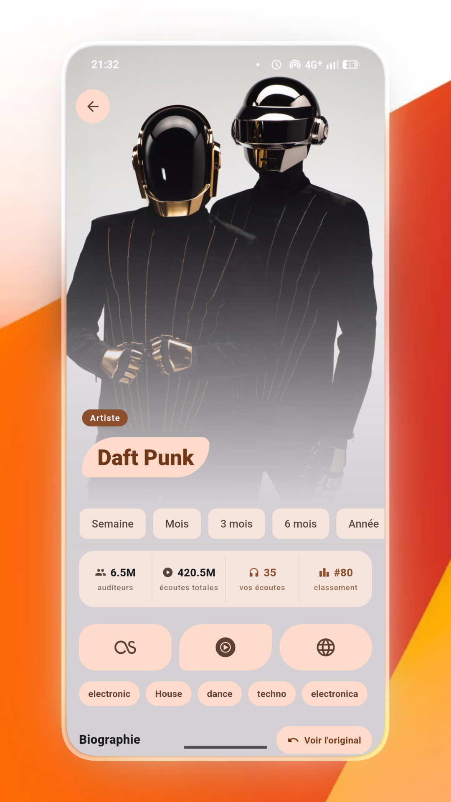
  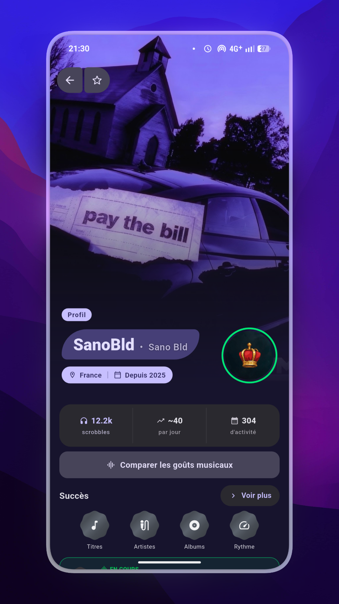
</p>
<p align="center">
  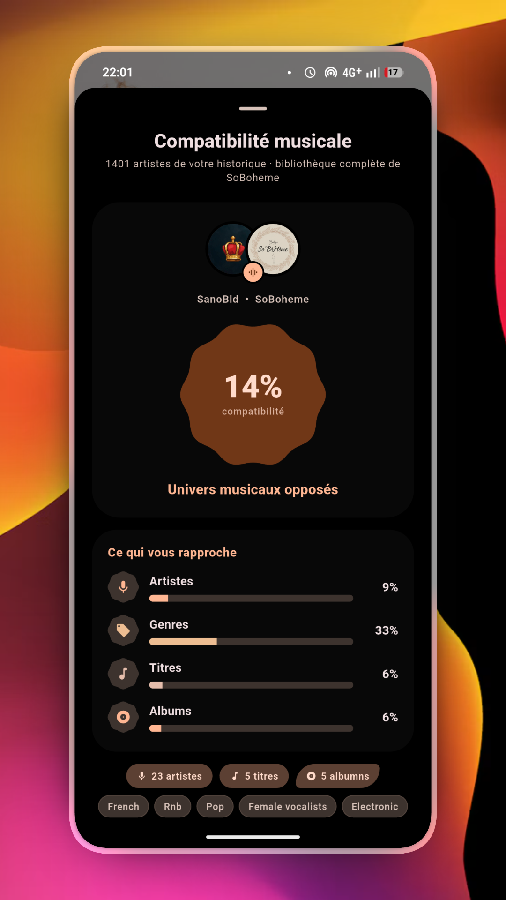
  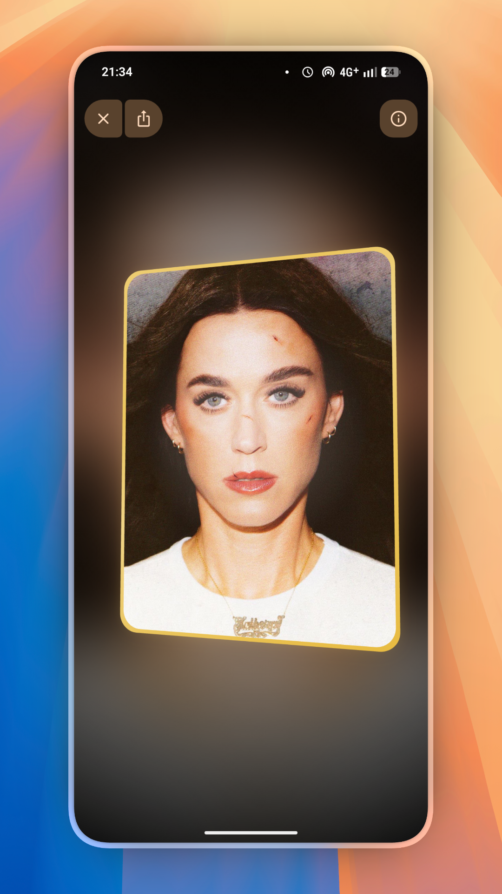
  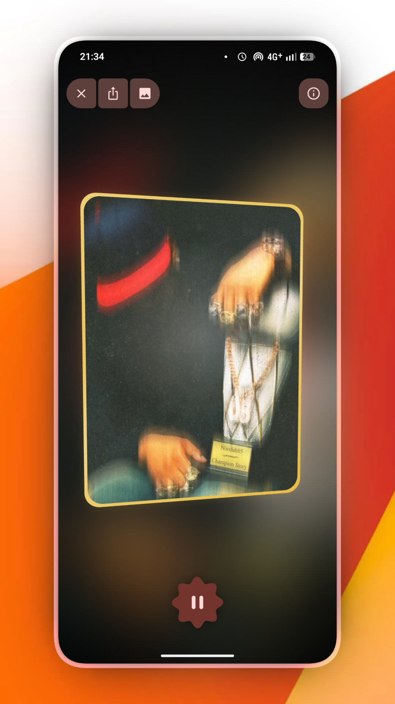
  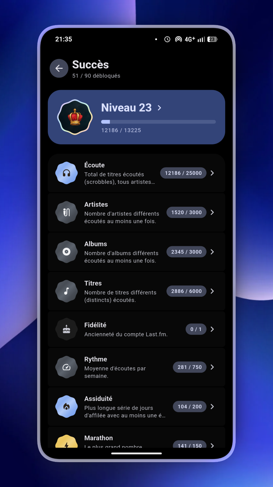
  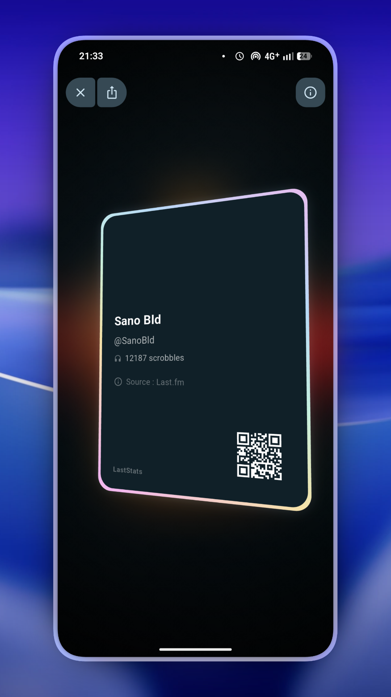
</p>
<p align="center">
  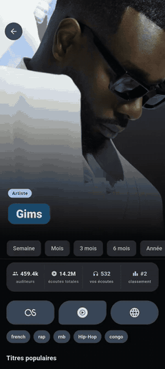
  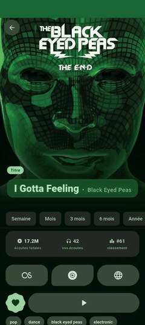
</p>

---

## Features

**🎨 Design and theming**
- Material 3 Expressive: shaped images (cookie, circle, clover, arch, leaf and more, or one single shape, or square), spring animations, wavy loading indicators and grouped, rounded settings
- Full support for system light and dark mode, plus a pure black OLED theme for AMOLED screens
- Custom accent colors, either from presets or your own hex code, or dynamic color that matches your device's system palette
- Optional Now Playing color mode, where the app's accent shifts to match the artwork of the track you are listening to, with a fallback color and the option to keep the last color once playback stops
- Optional tinted detail sheets, using the dominant color pulled from the album artwork
- Adaptive layout: a side rail and a centered panel on wide screens (tablet and PC), a bottom bar on phones, and a manual switch if you prefer one over the other

**🏠 Dashboard and Discover**
- Your own nickname, shown instead of your raw Last.fm account name
- Quick stats, now playing, recent tracks and a friends section, with a listening calendar (last 60 days) or monthly bars
- Reorder the sections by drag and drop, and choose which stat cards and filters to show
- Discover: swipeable music ideas (your top artist, your country, trending worldwide, and "On this day" from your own history), with an optional endless loop and filters sorted by what is most relevant right now

**🎤 Artist, album and track pages**
- Full pages with biography (with a translate button), your stats, global stats, rank, tags and popular tracks
- Animated posters: Apple Music motion artwork, with a short silent YouTube loop as a fallback, plus a 3D flip card for the cover art
- Lyrics for tracks, and quick links to your music platforms

**👥 Friends and music compatibility**
- Follow your Last.fm friends' activity, see who is listening right now, and open their full profile
- Compare your music tastes: a compatibility score broken down by artists, genres, tracks and albums, with everything you have in common
- Profile cards with an optional QR code: scan a QR code to open a profile

**📊 Charts, rankings, history and recaps**
- Charts for scrobbles per month, progress over time and a multi-year heatmap, for all time or a given year
- Rankings of your top artists, albums and tracks with a podium, by year, month or all time
- Day-by-day history with the exact time of each scrobble
- Daily, weekly and monthly recaps in a story format, shareable as images

**❤️ Favorites**
- Like tracks, artists, and albums directly from the app, through your own Last.fm account
- A dedicated Favorites page with folders, filters and cover art
- A small heart badge next to loved tracks in your recent listens, history, and search results, with an option to turn it off

**🏆 Achievements**
- A leveling system based on your real listening activity, with dozens of achievements to unlock
- Categories covering listening totals, artist and album diversity, loyalty, pace, streaks, and more

**📚 Library options**
- Link versions of the same track: remasters, singles, (feat. ...) and deluxe editions count together, while remixes and live versions stay separate
- Split collaborations: "Gims & Damso" counts for both artists, while bands such as "Simon & Garfunkel" stay whole

**📊 Data, accounts and sync**
- Direct connection to the Last.fm API for real, live scrobbles, top artists, albums, and tracks
- Use your own API key, or the app's built-in backup key, and change it any time in Settings
- An API tab showing today's requests per service, with an optional request limiter
- Flexible time ranges: 7 days, 1 month, 3 months, 6 months, 12 months, or all time
- Background sync that keeps your stats up to date automatically, even when the app is closed
- Offline-friendly cache with a storage breakdown, and backups where you choose what to export and restore
- Smart artwork search: if Last.fm has no image, the app looks it up through Wikipedia, iTunes, Deezer, TheAudioDB, MusicBrainz, and the Cover Art Archive
- No fake or simulated data, everything comes from your real listening history

**🔎 Search**
- A dedicated search tab for artists, albums, tracks, and Last.fm profiles, with rich detail sheets
- Search bar in the news page too, filtering by title and content as you type

**📤 Sharing**
- Share artwork, charts, achievement badges, recap cards and your profile card (with an optional QR code) anywhere, including Windows, macOS, and Linux, where the file is saved and revealed directly in your file explorer

**🔔 Notifications**
- Daily and weekly recaps, scrobble milestones, sync alerts, and news and update alerts
- Every notification type can be turned on or off at any time, on every supported platform including Windows

**🌍 Languages**
- Available in French, English, Spanish, Chinese, Portuguese, German, Italian, Japanese, Russian, and Arabic
- The app follows your system language automatically, or you can pick one yourself from the settings
- All translations are generated with AI assistance and may contain the occasional inaccuracy

**⚙️ Other little touches**
- Haptic feedback on key actions
- Import and export your settings and appearance, useful when switching devices
- Built in update checker that lets you know as soon as a new version is ready to download

---

## 📥 Downloads

You can find every release, for every platform, on the releases page:

https://github.com/SanoBld/LastStats-App/releases

Prebuilt files are also generated automatically after each update, through GitHub Actions:

https://github.com/SanoBld/LastStats-App/actions

Builds coming straight from Actions contain the latest code and may include bugs that have not been fixed yet. If you want a stable experience, use the releases page instead.

Supported platforms: **Android, Windows, macOS, Linux (x64 and ARM64), and iOS (unsigned, sideload only).**

No install needed? Try the **web version (Beta)**: https://sanobld.github.io/LastStats/app/

---

## 💻 Installation

### Android
1. Download the `.apk` file for your phone from the [releases page](https://github.com/SanoBld/LastStats-App/releases): `app-arm64-v8a-release.apk` for most phones (2018+), `app-armeabi-v7a-release.apk` for older 32-bit phones, `app-x86_64-release.apk` for emulators, or `app-universal-release.apk` if unsure.
2. Open it on your phone. If Android blocks the install, allow "Install unknown apps" for the app you used to open the file (browser or file manager), then try again.

### Windows
1. Download the installer from the [releases page](https://github.com/SanoBld/LastStats-App/releases): `LastStats-Setup-x64.exe` for most PCs, `LastStats-Setup-arm64.exe` for Windows on ARM (Snapdragon). Prefer no install? Use `laststats-windows.zip` / `laststats-windows-arm64.zip`, unzip it anywhere, then run `LastStats.exe`.
2. Run the installer and follow the wizard.
3. Windows SmartScreen may warn about an unrecognized app since the build isn't code-signed — click "More info" then "Run anyway" to continue.
4. Sharing files from the app (charts, artwork, etc.) saves them to your Downloads folder and opens Explorer with the file selected — this is expected on an unpackaged build like this one.

### macOS
1. Download the `.dmg` for your Mac from the [releases page](https://github.com/SanoBld/LastStats-App/releases): `LastStats-macos-arm64.dmg` for Apple Silicon (M1 and later), `LastStats-macos-x64.dmg` for Intel Macs, or `LastStats-macos.dmg` (universal, works on both). `.zip` versions (`laststats-macos-arm64.zip`, `laststats-macos-x64.zip`, `laststats-macos.zip`) are also available.
2. Open it and drag `LastStats.app` onto the `Applications` shortcut.
3. Since the build isn't notarized, the first launch requires right-click → "Open" → "Open" again (macOS will otherwise refuse to run apps from an unidentified developer).

### Linux
Pick the file for your CPU (`x64` for most PCs, `arm64` for ARM devices) on the [releases page](https://github.com/SanoBld/LastStats-App/releases):
- **One command (any distro):** `curl -fsSL https://github.com/SanoBld/LastStats-App/releases/latest/download/install-linux.sh | bash` — detects your distro and CPU and installs the right package.
- **Debian / Ubuntu / Mint:** `LastStats-linux-<arch>.deb` — double-click it (software center opens an install wizard) or run `sudo apt install ./LastStats-linux-<arch>.deb`. Uninstall with `sudo apt remove laststats`.
- **Fedora / openSUSE / RHEL:** `LastStats-linux-<arch>.rpm` — double-click it or run `sudo dnf install ./LastStats-linux-<arch>.rpm`. Uninstall with `sudo dnf remove laststats`.
- **Any distro, no install:** `LastStats-linux-<arch>.AppImage` — `chmod +x` it, then run it.
- **Manual:** `laststats-linux.zip` (x64) / `laststats-linux-arm64.zip`, extract and run `LastStats`.

### iOS
1. Download `LastStats-ios.ipa` from the [releases page](https://github.com/SanoBld/LastStats-App/releases).
2. The app is **not signed** (no Apple certificate is used on CI), so it can't be installed directly: sideload it with AltStore, Sideloadly or TrollStore, or re-sign it with your own Apple account.

### Building from source
Requires the [Flutter SDK](https://docs.flutter.dev/get-started/install) (matching the version in `pubspec.yaml`).

```bash
git clone https://github.com/SanoBld/LastStats.git
cd LastStats
flutter pub get
flutter run              # run on a connected device/emulator
flutter build apk        # or: windows / macos / linux
```

---

## 🛠️ Built with

- Flutter and Dart
- Material Design 3 (Material You)
- Last.fm REST API, with Wikipedia, iTunes Search, Deezer, TheAudioDB, MusicBrainz, and the Cover Art Archive as backup sources for missing artwork
- Apple Music and YouTube for animated posters, LRCLIB (with lyrics.ovh as a fallback) for lyrics, ListenBrainz for worldwide trends in Discover, and Google Translate for biography translation
- The full list of open-source packages used is visible in-app, under Settings → About, each linking to its pub.dev page

---

## ⭐ Star history

<a href="https://www.star-history.com/?repos=SanoBld%2FLastStats&type=date&legend=bottom-right">
  <picture>
    <source media="(prefers-color-scheme: dark)" srcset="https://api.star-history.com/chart?repos=SanoBld/LastStats&type=date&theme=dark&legend=bottom-right&sealed_token=HPdAtBd_SqXDFn9kceQbK4v2Y9TWhOHofoeJdVEg6ySsn4d6BIVPGnnzOdJTzakACyiXmSuvx3pcxDxFhKAQGRJeNwTOvQCCgtJAiBLI0lwOV-hvdNK7mjYRc6PNgeRUWuYssia0e3HcQzx2HzpQuk-OL413b31tu3EgDg2cSVzauc-Lnf76K_FS3vQi" />
    <source media="(prefers-color-scheme: light)" srcset="https://api.star-history.com/chart?repos=SanoBld/LastStats&type=date&legend=bottom-right&sealed_token=HPdAtBd_SqXDFn9kceQbK4v2Y9TWhOHofoeJdVEg6ySsn4d6BIVPGnnzOdJTzakACyiXmSuvx3pcxDxFhKAQGRJeNwTOvQCCgtJAiBLI0lwOV-hvdNK7mjYRc6PNgeRUWuYssia0e3HcQzx2HzpQuk-OL413b31tu3EgDg2cSVzauc-Lnf76K_FS3vQi" />
    
  </picture>
</a>

---

## 🙋 Support and feedback

Found a bug, or have an idea for a new feature? Open an issue here:

https://github.com/SanoBld/LastStats-App/issues

Or join the Discord to chat directly and follow what's coming next:

https://discord.gg/JjqmkQgZBs

---

## 📄 License

This project is released under the **MIT License** — see [LICENSE](LICENSE) for the full text.

In short: use it, modify it, duplicate it, redistribute it, for any purpose — just credit Sano Bld.

AI was used as a tool for part of the development and for the in-app translations.

## About

This project is developed independently, in my free time. It is open source, so you are free to use it, modify it, or contribute to it. If you enjoy the app, a star on the repository always helps.
